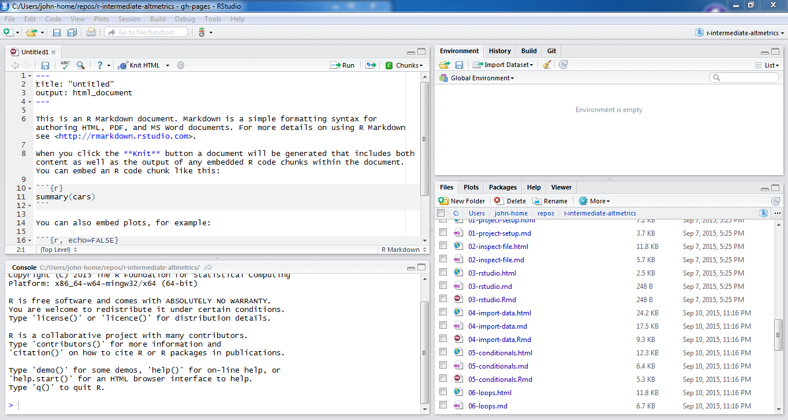
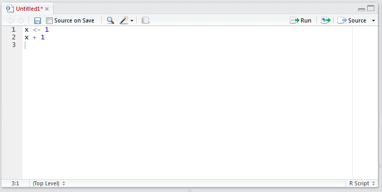
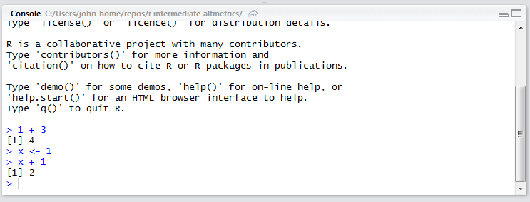
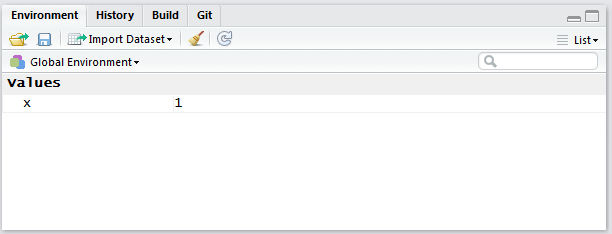
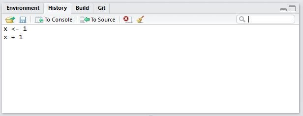
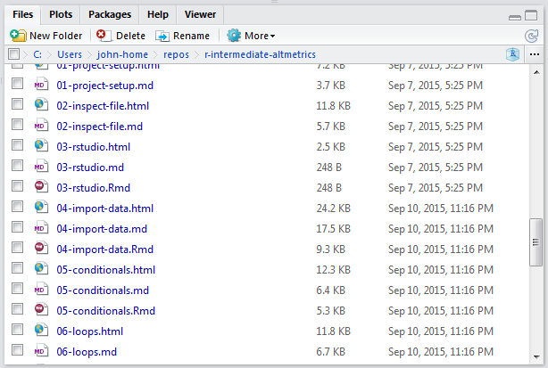
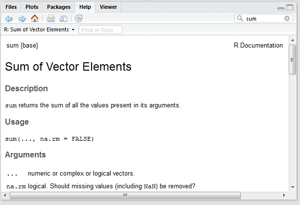

```{r setup, include=FALSE}
knitr::opts_chunk$set(echo = TRUE)
```

## Welcome - outline

Welcome to the Intro Statistics with R workshop. 
Our goal is to give you a crash course introduction into how to do basic statistics in the free and widely used statistical programming language R. 

On Day 1, we will focus on learning R. 
The learning objectives for today are:

* Assign variables
* Read data into and out of R
* Learn data types
* Learn to subset data
* Calculate basic statistics on data
* Make some plots
* Load a library

## RStudio
We will use R via the interactive development environment (IDE) RStudio.
In this lesson we'll explore some of its useful features.



### The different panels

First, let's open a new R script in the text editor ("File" -> "New File" -> "R Script").
One of the biggest advantages of using RStudio is how easy it makes to test new code your write.
Let's write a few lines of code in the text editor.



By clicking on the button that says "Run", we can send a line from the script to the Console to be executed.
If we highlight multiple lines of code, all these lines will be run in the Console.
As a shortcut, you can press "Ctrl-Enter" instead of clicking on the "Run" button.



The R Console works the same as if you accessed R from the Unix shell or the Windows R GUI.
Recall that the up and down arrows browse through past commands.

The Environment panel describes all the objects present in the R session.
It is similar to `ls`, but gives additional details like what is stored in the object.



The History panel displays all the past commands that were run in the Console.
These past commands can be selected and then sent either to the script ("Source") or to the Console to be run again.



The Files panel shows all the available files available in the current working directory.



The Help panel shows the documentation for R functions.
We can either run `?` in front of the function name to bring up the documentation, e.g. `?sum`.
Alternatively, we can put the cursor on the name of the function and press the F1 key.



Lastly the Plots panel will display any graphs we create and the Packages panel shows which packages have been installed.

## Assign variables

You can get output from R simply by typing math in the console:

```{r, purl=FALSE}
3 + 5
12 / 7
```

However, to do useful and interesting things, we need to assign _values_ to
_objects_. To create an object, we need to give it a name followed by the
assignment operator `<-`, and the value we want to give it:

```{r, purl=FALSE}
weight_kg <- 55
```

`<-` is the assignment operator. It assigns values on the right to objects on
the left. So, after executing `x <- 3`, the value of `x` is `3`. The arrow can
be read as 3 **goes into** `x`.  For historical reasons, you can also use `=`
for assignments, but not in every context. Because of the
[slight](http://blog.revolutionanalytics.com/2008/12/use-equals-or-arrow-for-assignment.html)
[differences](http://r.789695.n4.nabble.com/Is-there-any-difference-between-and-tp878594p878598.html)
in syntax, it is good practice to always use `<-` for assignments.

In RStudio, typing <kbd>Alt</kbd> + <kbd>-</kbd> (push <kbd>Alt</kbd> at the
same time as the <kbd>-</kbd> key) will write ` <- ` in a single keystroke in a PC, while typing <kbd>Option</kbd> + <kbd>-</kbd> (push <kbd>Option</kbd> at the
same time as the <kbd>-</kbd> key) does the same in a Mac.

Objects can be given any name such as `x`, `current_temperature`, or
`subject_id`. You want your object names to be explicit and not too long. They
cannot start with a number (`2x` is not valid, but `x2` is). R is case sensitive
(e.g., `weight_kg` is different from `Weight_kg`). There are some names that
cannot be used because they are the names of fundamental functions in R (e.g.,
`if`, `else`, `for`, see
[here](https://stat.ethz.ch/R-manual/R-devel/library/base/html/Reserved.html)
for a complete list). In general, even if it's allowed, it's best to not use
other function names (e.g., `c`, `T`, `mean`, `data`, `df`, `weights`). If in
doubt, check the help to see if the name is already in use. 

Now that R has `weight_kg` in memory, we can do arithmetic with it. For
instance, we may want to convert this weight into pounds (weight in pounds is 2.2 times the weight in kg):

```{r, purl=FALSE}
2.2 * weight_kg
```

We can also change an object's value by assigning it a new one:

```{r, purl=FALSE}
weight_kg <- 57.5
2.2 * weight_kg
```

This means that assigning a value to one object does not change the values of
other objects  For example, let's store the animal's weight in pounds in a new
object, `weight_lb`:

```{r, purl=FALSE}
weight_lb <- 2.2 * weight_kg
```

and then change `weight_kg` to 100.

```{r, purl=FALSE}
weight_kg <- 100
```

What do you think is the current content of the object `weight_lb`? 126.5 or 220?

### Comments

The comment character in R is `#`, anything to the right of a `#` in a script
will be ignored by R. It is useful to leave notes, and explanations in your
scripts.
RStudio makes it easy to comment or uncomment a paragraph: after selecting the
lines you  want to comment, press at the same time on your keyboard
<kbd>Ctrl</kbd> + <kbd>Shift</kbd> + <kbd>C</kbd>. If you only want to comment
out one line, you can put the cursor at any location of that line (i.e. no need 
to select the whole line), then press <kbd>Ctrl</kbd> + <kbd>Shift</kbd> + 
<kbd>C</kbd>.

## Reading data into R

The most common way to read data into R is using the function `read.table`.

Let's tell R to read in some data we've saved as a .csv file using the `read.table` function:

```{r}
surveys <- read.table("portal_data_joined.csv", sep = ",", header = TRUE, stringsAsFactors = FALSE)
```

Three things I often do when first reading in data are:

1. Check the size
2. See what the columns are
3. Look at the first few lines

To find the number of rows and columns, use `dim`. 
In R, rows are always listed first, and columns listed second. 

```{r}
dim(surveys)
```

To see a small overview of the columns, use `str`.

```{r}
str(surveys)
```

To see the first few lines of the data set, use `head`

```{r}
head(surveys)
```

## Data classes and types

We've now seen a couple of different data types that you can work with in R. 
An **atomic vector** is the simplest R **data type** and is a linear vector of a single type. 
`weight_kg` was example if this type. 
You can add more elements to this vector by using `c()`. 
For example, say we had a second weight (52.3kg) that we wanted to record:

```{r}
weight_kg <- c(weight_kg, 52.3)
weight_kg
```

The values stored in weight_kg are `"numeric"`.
Other data types are:

* `"logical"` for `TRUE` and `FALSE` (the boolean data type)
* `"integer"` for integer numbers (e.g., 1, 2, 3)
* `"character"` for any text (e.g. "cat", "dog", "wombat")
* `"factor"` for any value you wish to be treated as a grouping variable (e.g. case, control)

Vectors are one of the many **data structures** that R uses. Other important
ones are lists (`list`), matrices (`matrix`), and data frames (`data.frame`).

The data we read in earlier is saved as a `data.frame`.
We can test that using the function `class()`

```{r}
class(surveys)
```

The `str` function displays the class information for each column of our data.frame:

```{r}
str(surveys)
```

We can see that `surveys` has two classes of data: `int`, which stands for "integers" and `chr` which stands for "character."


## Subsetting data

## Calculating basic statistics on data

## Plotting

## Loading libraries


