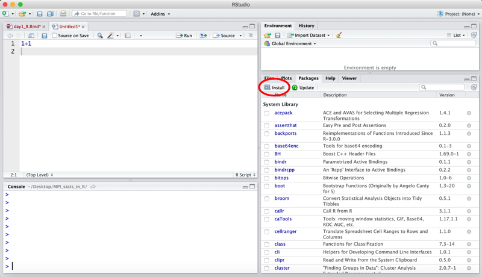
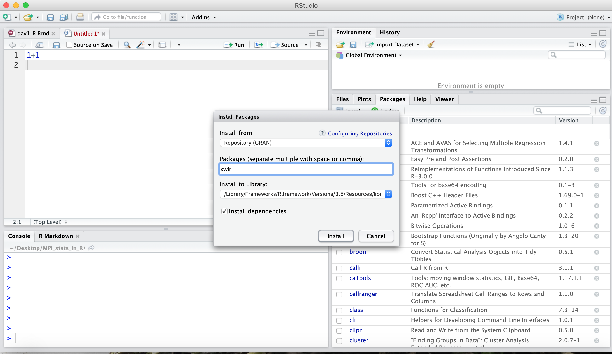

```{r setup, include=FALSE}
knitr::opts_chunk$set(echo = TRUE)
```

## Welcome - outline

Welcome to the Intro Statistics with R workshop. 
Our goal is to give you a crash course introduction into how to do basic statistics in the free and widely used statistical programming language R. 

On Day 1, we will focus on learning R. 
The learning objectives for today are:

* Assign variables
* Read data into and out of R
* Learn data types
* Learn to subset data
* Calculate basic statistics on data
* Make some plots
* Load a library

Today we'll be working with a data set of [ecological survey](https://figshare.com/articles/Portal_Project_Teaching_Database/1314459) data that have been pruned a bit. It consists of actual biological data collected over time in the Chihuahuan Desert in Arizona. 

## RStudio
We will use R via the interactive development environment (IDE) RStudio.
In this lesson we'll explore some of its useful features.


### The different panels

First, let's open a new R script in the text editor ("File" -> "New File" -> "R Script").
One of the biggest advantages of using RStudio is how easy it makes to test new code your write.
Let's write a few lines of code in the text editor.


By clicking on the button that says "Run", we can send a line from the script to the Console to be executed.
If we highlight multiple lines of code, all these lines will be run in the Console.
As a shortcut, you can press "Ctrl-Enter" instead of clicking on the "Run" button.


Using the up and down arrows you to browse through past commands.

The Environment panel describes all the objects present in the R session.


The History panel displays all the past commands that were run in the Console.
These past commands can be selected and then sent either to the script ("Source") or to the Console to be run again.


The Files panel shows all the available files available in the current working directory.


The Help panel shows the documentation for R functions.
We can either run `?` in front of the function name to bring up the documentation, e.g. `?sum`.
Alternatively, we can put the cursor on the name of the function and press the F1 key.


Lastly the Plots panel will display any graphs we create and the Packages panel shows which packages have been installed.

## Assign variables

You can get output from R simply by typing math in the console:

```{r, purl=FALSE}
3 + 5
12 / 7
```

However, to do useful and interesting things, we need to assign _values_ to
_objects_. To create an object, we need to give it a name followed by the
assignment operator `<-`, and the value we want to give it:

```{r, purl=FALSE}
weight_kg <- 55
```

`<-` is the assignment operator. It assigns values on the right to objects on
the left. So, after executing `x <- 3`, the value of `x` is `3`. The arrow can
be read as 3 **goes into** `x`.  For historical reasons, you can also use `=`
for assignments, but not in every context. Because of the
[slight](http://blog.revolutionanalytics.com/2008/12/use-equals-or-arrow-for-assignment.html)
[differences](http://r.789695.n4.nabble.com/Is-there-any-difference-between-and-tp878594p878598.html)
in syntax, it is good practice to always use `<-` for assignments.

In RStudio, typing <kbd>Alt</kbd> + <kbd>-</kbd> (push <kbd>Alt</kbd> at the
same time as the <kbd>-</kbd> key) will write ` <- ` in a single keystroke in a PC, while typing <kbd>Option</kbd> + <kbd>-</kbd> (push <kbd>Option</kbd> at the
same time as the <kbd>-</kbd> key) does the same in a Mac.

Objects can be given any name such as `x`, `current_temperature`, or
`subject_id`. You want your object names to be explicit and not too long. They
cannot start with a number (`2x` is not valid, but `x2` is). R is case sensitive
(e.g., `weight_kg` is different from `Weight_kg`). There are some names that
cannot be used because they are the names of fundamental functions in R (e.g.,
`if`, `else`, `for`, see
[here](https://stat.ethz.ch/R-manual/R-devel/library/base/html/Reserved.html)
for a complete list). In general, even if it's allowed, it's best to not use
other function names (e.g., `c`, `T`, `mean`, `data`, `df`, `weights`). If in
doubt, check the help to see if the name is already in use. 

Now that R has `weight_kg` in memory, we can do arithmetic with it. For
instance, we may want to convert this weight into pounds (weight in pounds is 2.2 times the weight in kg):

```{r, purl=FALSE}
2.2 * weight_kg
```

We can also change an object's value by assigning it a new one:

```{r, purl=FALSE}
weight_kg <- 57.5
2.2 * weight_kg
```

This means that assigning a value to one object does not change the values of
other objects  For example, let's store the animal's weight in pounds in a new
object, `weight_lb`:

```{r, purl=FALSE}
weight_lb <- 2.2 * weight_kg
```

and then change `weight_kg` to 100.

```{r, purl=FALSE}
weight_kg <- 100
```

What do you think is the current content of the object `weight_lb`? 126.5 or 220?

### Comments

The comment character in R is `#`, anything to the right of a `#` in a script
will be ignored by R. It is useful to leave notes, and explanations in your
scripts.
RStudio makes it easy to comment or uncomment a paragraph: after selecting the
lines you  want to comment, press at the same time on your keyboard
<kbd>Ctrl</kbd> + <kbd>Shift</kbd> + <kbd>C</kbd>. If you only want to comment
out one line, you can put the cursor at any location of that line (i.e. no need 
to select the whole line), then press <kbd>Ctrl</kbd> + <kbd>Shift</kbd> + 
<kbd>C</kbd>.

## Reading data into R

The most common way to read data into R is using the function `read.table`.

Let's tell R to read in some data we've saved as a .csv file using the `read.table` function:

```{r}
surveys <- read.table("surveys_complete.csv", sep = ",", header = TRUE, stringsAsFactors = FALSE)
```

Three things I often do when first reading in data are:

1. Check the size
2. See what the columns are
3. Look at the first few lines

To find the number of rows and columns, use `dim`. 
In R, rows are always listed first, and columns listed second. 

```{r}
dim(surveys)
```

To see a small overview of the columns, use `str`.

```{r}
str(surveys)
```

To see the first few lines of the data set, use `head`

```{r}
head(surveys)
```

## Data classes and types

We've now seen a couple of different data types that you can work with in R. 
An **atomic vector** is the simplest R **data type** and is a linear vector of a single type. 
`weight_kg` was example if this type. 
You can add more elements to this vector by using `c()`. 
For example, say we had a second weight (52.3kg) that we wanted to record:

```{r}
weight_kg <- c(weight_kg, 52.3)
weight_kg
```

The values stored in weight_kg are `"numeric"`.
Other data types are:

* `"logical"` for `TRUE` and `FALSE` (the boolean data type)
* `"integer"` for integer numbers (e.g., 1, 2, 3)
* `"character"` for any text (e.g. "cat", "dog", "wombat")
* `"factor"` for any value you wish to be treated as a grouping variable (e.g. case, control)

Vectors are one of the many **data structures** that R uses. Other important
ones are lists (`list`), matrices (`matrix`), and data frames (`data.frame`).

The data we read in earlier is saved as a `data.frame`.
We can test that using the function `class()`

```{r}
class(surveys)
```

The `str` function displays the class information for each column of our data.frame:

```{r}
str(surveys)
```

We can see that `surveys` has two classes of data: `int`, which stands for "integers" and `chr` which stands for "character."

## Subsetting data

There are a few ways to pull out specific values of our data. If we have a vector and we wish to look at the first entry, you type the name of the vector and the number 1 in brackets:

```{r}
weight_kg[1]
```

If we want to look at the second value, type 2 in brackets:

```{r}
weight_kg[2]
```

For 2-dimensional data types, you'll type the number of the row, comma, the number of the column you wish to reference. 
For example, let's look at the value in the second row, third column in surveys:

```{r}
surveys[2, 3]
```

Let's look at the first row, fifth column:

```{r}
surveys[1, 5]
```

You can look at entire row by reference the number of that row and leaving the column position blank. 
Let's look at all of the first row of `surveys`:

```{r}
surveys[1, ]
```

To reference the `hindfoot_length` column, which is the 8th column, we can type:

```{r, results="hide"}
surveys[ ,8]
```
[Note: the above code should output 30,000 values of hindfoot length to your R terminal, but I've hidden them here.]

You can also reference columns of a dataframe by the name of the column. 
Let's look at all of the `hindfoot_length` values in `surveys`:

```{r, results="hide"}
surveys$hindfoot_length
```

[Note: the above code should output 30,000 values of hindfoot length to your R terminal, but I've hidden them here.] 

Let's say we want to only look at the first five values of `hindfoot_length`. 
To do that, we can "slice" the data where we put the number of the element we want to start on, `:`, the number of the element we want to end on. 
To get the first five values of `hindfoot_length`:

```{r}
surveys$hindfoot_length[1:5]
```

We can also look at multiple elements of `hindfoot_length` that aren't all next to each other by indexing using the `c()` function.
Let's look at at the 1, 4, 5, and 7th elements of `hindfoot_length`:

```{r}
surveys$hindfoot_length[c(1, 4, 5, 7)]
```

## Calculating basic statistics on data

R is a statistical language with many useful statistics functions available. 
Let's calculate some basic statistics on `hindfoot_length`.

What is the mean value of `hindfoot_length`?

```{r}
mean(surveys$hindfoot_length)
```

Let's calculate the median value of `hindfoot_length`:

```{r}
median(surveys$hindfoot_length)
```

Let's calculate the standard deviation of `hindfoot_length`:

```{r}
sd(surveys$hindfoot_length)
```

Often it's useful to quickly glance at all of these statistics and more for our data. 
We can use the `summary()` function to find the minimum, 1st quartile, median, mean, 3rd quartile, and maximum value in our data:

```{r}
summary(surveys$hindfoot_length)
```

## Plotting

Another nice feature about R is that there are many functions built in to plot your data. 
Let's use some of these functions to quickly look at some of the relationships between the variables in our dataset. 

Let's create a scatterplot to compare `hindfoot_length` with `weight`. 
The function `plot()` will plot two sets of values against each other along the x and y axis. 
Let's have `hindfoot_length` along the x-axis and `weight` along the y-axis:

```{r}
plot(surveys$hindfoot_length, surveys$weight)
```

Let's look at the help documentation for `plot()` to see how we can make our plot look exactly like we want. 

Let's add more descriptive axis titles, a main title, and color the points blue:

```{r}
plot(surveys$hindfoot_length, surveys$weight, xlab = "hindfoot length (cm)", ylab = "weight (g)", main = "Relationship of hindfoot length to weight in desert creatures", col = "blue")
```

We can also make boxplots easily in R. 
Let's make a boxplot of the distribution of `hindfoot_length` by sex:

```{r}
boxplot(surveys$hindfoot_length ~ surveys$sex)
```

Let's pretty up the plot by including labels and coloring in the boxes. 

```{r}
boxplot(surveys$hindfoot_length ~ surveys$sex, xlab = "sex", ylab = "hindfoot length (cm)", main = "Distributions of hindfoot lengths by sex in desert creatures", col = c("pink", "lightblue"))
```

## Loading libraries

R comes with many functions built in (like all of the functions we've been using). 
One of the powerful aspects of R is that anyone can create their own functions and share those with others in bundles called libraries. 
There is one main location where R libraries are stored, which is called [CRAN](https://cran.r-project.org/) (which stands for the Comprehensive R Archive Network). 
In RStudio, you can install packages to your local version of R by going over to the "Packages" tab, clicking the "Install" button, and typing in the name of the package you wish install. 

Since today was so short, I recommend that you install a [package that will help you keep learning R in R called swirl.](https://swirlstats.com/).

Go over to the Packages tab and click the "Install" button. 



When the window pops up to install packages, type in the name "swirl", make sure the "install dependencies" tab is checked, and click "install".



The code for this package now lives on our computer.
However, these functions aren't automatically loaded into R. 
You have to tell R which libraries you'd like to open up each time you load R. 
Let's tell R to load up the `swirl` package:

```{r}
library("swirl")
```

You'll see that this package has a bunch of interactive lessons that you can do right from within R to help learn the language. 

There are tons and tons of libraries available for R, to do everything from advanced statistical methods, machine learning, data cleaning, or parallelization. 
There is a great list of [awesome R packages here](https://awesome-r.com/).
Once you get familiar with R, I recommend learning the packages written by Hadley Wickham, including `ggplot2` for plotting, `dplyr` for data munging, and `readr` for reading in large data sets quickly. 

